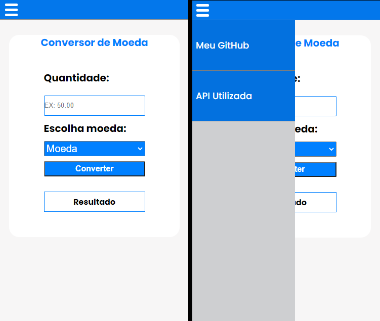

# Conversor de Moedas
 Um conversor de moedas feito em **HTML**, **CSS** e **JavaScript** usando a função **fetch()** para fazer requisições a uma **API**
 
Para testar o projeto clique [aqui](https://jeanluca999.github.io/Conversor-de-Moedas/)
 ***
 
